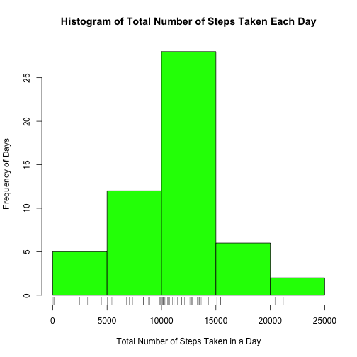
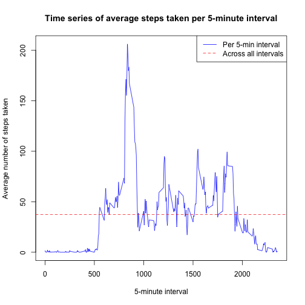
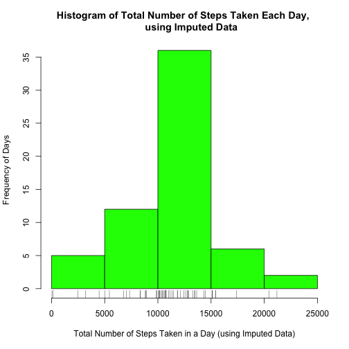
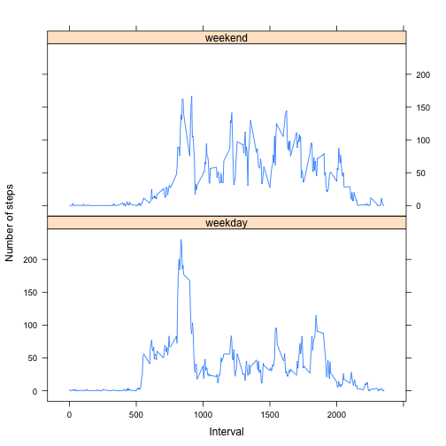

PEER ASSESSMENT 1
-----------------------------------------------------------------

Have all results show in the final output:  
  

```r
library(knitr)
opts_chunk$set(echo=TRUE)
```

### A) READ IN DATA ###

Unzip and load data in R:


```r
unzip("activity.zip")
rawdata <- read.csv("activity.csv", header = TRUE) ## Assumes that data is already in working directory

head(rawdata)
```

```
##   steps       date interval
## 1    NA 2012-10-01        0
## 2    NA 2012-10-01        5
## 3    NA 2012-10-01       10
## 4    NA 2012-10-01       15
## 5    NA 2012-10-01       20
## 6    NA 2012-10-01       25
```

### B) MEAN AND MEDIAN ###

Calculate total number of steps taken each day, plot histogram, and determine the mean and median:


```r
library(dplyr)

## Add up the total number of steps taken each day
sum_steps <- rawdata %>% group_by(date) %>% summarise(total_steps=sum(steps))
head(sum_steps)
```

```
## Source: local data frame [6 x 2]
## 
##         date total_steps
## 1 2012-10-01          NA
## 2 2012-10-02         126
## 3 2012-10-03       11352
## 4 2012-10-04       12116
## 5 2012-10-05       13294
## 6 2012-10-06       15420
```


```r
## Plot histogram
hist(sum_steps$total_steps, col = "green",
     main = "Histogram of Total Number of Steps Taken Each Day",
     xlab = "Total Number of Steps Taken in a Day",
     ylab = "Frequency of Days") 

rug(sum_steps$total_steps)
```

 


```r
## Calculate mean & median of steps taken each day
mean_steps <- format(round(mean(sum_steps$total_steps, na.rm=TRUE),0),big.mark= ",")
print(mean_steps)
```

```
## [1] "10,766"
```

```r
median_steps <- format(round(median(sum_steps$total_steps, na.rm=TRUE),0), big.mark = ",")
print(median_steps)
```

```
## [1] "10,765"
```

**The mean number of steps taken each day is 10,766;  
the median number of steps taken is 10,765.**


### C) AVERAGE DAILY ACTIVITY PATTERN ###

Remove NAs from raw data:


```r
rawdata_l <- complete.cases(rawdata)
data <- rawdata[rawdata_l,]
```

Plot a time series graph of the average steps taken in each 5-minute interval, and determine the 5-minute interval with the maximum average number of steps:


```r
# Avg steps by 5-minute interval
avgsteps_int <- rawdata %>% group_by(interval) %>% 
        summarise(avgsteps=mean(steps, na.rm = TRUE))
head(avgsteps_int)
```

```
## Source: local data frame [6 x 2]
## 
##   interval  avgsteps
## 1        0 1.7169811
## 2        5 0.3396226
## 3       10 0.1320755
## 4       15 0.1509434
## 5       20 0.0754717
## 6       25 2.0943396
```

```r
# Avg steps across all 5-minute intervals
mean_5minsteps <- mean(rawdata$steps, na.rm=TRUE)
print(mean_5minsteps)
```

```
## [1] 37.3826
```


```r
# Plot time series graph
with(avgsteps_int, plot(interval, avgsteps, type = "l", col = "blue",
        main = "Time series of average steps taken per 5-minute interval",
        xlab = "5-minute interval", ylab = "Average number of steps taken"))

abline(h = mean_5minsteps, lty = 2, col = "red")

legend("topright", lty = 1:2, col = c("blue", "red"),
       legend = c("Per 5-min interval", "Across all intervals"))
```

 

```r
# Determine the 5-minute interval with the maximum average number of steps
row_max_avgsteps <- which.max(avgsteps_int$avgsteps)
int_max_avgsteps <- as.numeric(avgsteps_int[row_max_avgsteps,1])
print(int_max_avgsteps)
```

```
## [1] 835
```

**The 5-minute interval with the maximum average number of steps is 835.**

### D) IMPUTING MISSING VALUES ###


```r
# Number of missing values
missing_int <- table(!is.na(rawdata$interval))
print(missing_int)
```

```
## 
##  TRUE 
## 17568
```

```r
missing_date <- table(!is.na(rawdata$date))
print(missing_int)
```

```
## 
##  TRUE 
## 17568
```

```r
missing_steps <- table(!is.na(rawdata$steps))
missing_steps <- format(missing_steps, big.mark=",")
print(missing_steps)
```

```
## 
##    FALSE     TRUE 
## " 2,304" "15,264"
```

**Based on this, there were  2,304 missing values in the data.**

**For these missing values, the average of the other values within that 5-minute interval was used in place of the missing values. The new data with the missing data filled in is now in the dataset 'imputedata':**


```r
## Impute data using avg of each 5-minute interval to replace NAs
imputedata <- left_join(rawdata, avgsteps_int, by = "interval")

imputedata$steps[is.na(imputedata$steps)] <- 
        imputedata$avgsteps[is.na(imputedata$steps)]  ## Any missing value in 'steps' variable is to be replaced by the 'avgsteps' variable

imputedata <- select(imputedata, c(1:3))
head(imputedata)
```

```
##       steps       date interval
## 1 1.7169811 2012-10-01        0
## 2 0.3396226 2012-10-01        5
## 3 0.1320755 2012-10-01       10
## 4 0.1509434 2012-10-01       15
## 5 0.0754717 2012-10-01       20
## 6 2.0943396 2012-10-01       25
```

Calculate total number of steps taken each day, plot histogram, and determine the mean and median, in similar vein to Question 1:


```r
## Add up the total number of steps taken each day, as per Q1
sum_steps2 <- imputedata %>% group_by(date) %>% summarise(total_steps2=sum(steps))
head(sum_steps2)
```

```
## Source: local data frame [6 x 2]
## 
##         date total_steps2
## 1 2012-10-01     10766.19
## 2 2012-10-02       126.00
## 3 2012-10-03     11352.00
## 4 2012-10-04     12116.00
## 5 2012-10-05     13294.00
## 6 2012-10-06     15420.00
```


```r
## Create a histogram of the number of steps taken each day, similarly to Q1
hist(sum_steps2$total_steps2, col = "green",
     main = "Histogram of Total Number of Steps Taken Each Day, 
     using Imputed Data",
     xlab = "Total Number of Steps Taken in a Day (using Imputed Data)",
     ylab = "Frequency of Days") 
rug(sum_steps2$total_steps2)
```

 


```r
## Calculate mean & median of steps taken each day, using imputed data
mean_steps2 <- format(round(mean(sum_steps2$total_steps2, na.rm=TRUE),0),big.mark= ",")
print(mean_steps2)
```

```
## [1] "10,766"
```

```r
median_steps2 <- format(round(median(sum_steps2$total_steps2, na.rm=TRUE),0), big.mark = ",")
print(median_steps2)
```

```
## [1] "10,766"
```

**The mean number of steps taken each day is 10,766;  
the median number of steps taken is 10,766.**

**Using this strategy of filling in the missing values, the mean and median remain relatively unchanged from the first part of the assignment.**


## E) WEEKDAY vs WEEKEND ##

Add weekday/weekend variable:


```r
## Add weekday/weekend variable
imputedata$date <- as.POSIXlt(imputedata$date)
imputedata <- mutate(imputedata, day_of_week = weekdays(imputedata$date))
weekend <- c("Saturday","Sunday")

week <- ifelse(imputedata$day_of_week %in% weekend, "weekend", "weekday")
imputedata <- mutate(imputedata, week = week)
imputedata$week <- as.factor(imputedata$week)
imputedata$date <- as.factor(as.character(imputedata$date))
head(imputedata)
```

```
##       steps       date interval day_of_week    week
## 1 1.7169811 2012-10-01        0      Monday weekday
## 2 0.3396226 2012-10-01        5      Monday weekday
## 3 0.1320755 2012-10-01       10      Monday weekday
## 4 0.1509434 2012-10-01       15      Monday weekday
## 5 0.0754717 2012-10-01       20      Monday weekday
## 6 2.0943396 2012-10-01       25      Monday weekday
```

```r
# Group by weekday/weekend
avgsteps_week <- imputedata %>% group_by(interval,week) %>% 
        summarise(avgsteps=mean(steps, na.rm = TRUE))
head(avgsteps_week)
```

```
## Source: local data frame [6 x 3]
## Groups: interval
## 
##   interval    week   avgsteps
## 1        0 weekday 2.25115304
## 2        0 weekend 0.21462264
## 3        5 weekday 0.44528302
## 4        5 weekend 0.04245283
## 5       10 weekday 0.17316562
## 6       10 weekend 0.01650943
```

Create graph:


```r
library(lattice)
par(mfrow = c(1,1))

xyplot(avgsteps ~ interval | week, data = avgsteps_week, layout = c(1, 2),
       type = "l", xlab = "Interval", ylab = "Number of steps")
```

 
